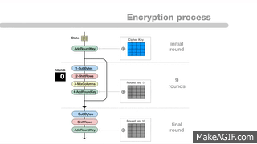
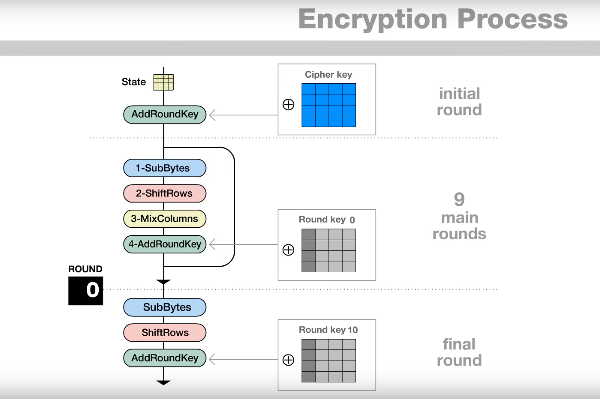
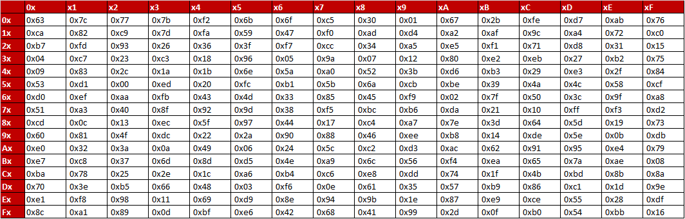
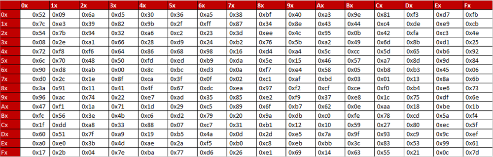
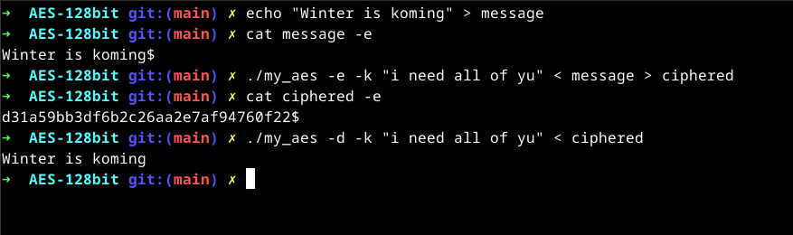
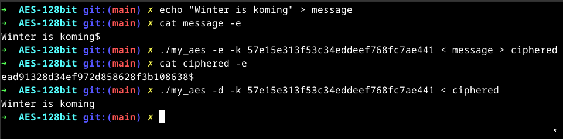
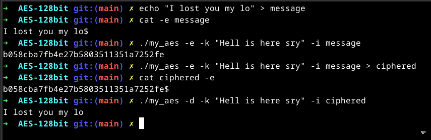

# My AES 128-bits implementation in python

## Description :

AES-128 bit re-implemented from epitech project.

Work in little endian.


## AES 128-bits :

__Advanced Encryption Standard__:

AES 128 is a __symmetric encryption algorithm__ that securely transforms plaintext data into ciphertext using a key. It operates on fixed-size 128-bit data blocks and performs a series of substitution, transposition, and mixing steps over multiple rounds. Each round scrambles the data, making it highly resistant to cryptanalysis. In AES-128, there are 10 rounds, each adding a layer of complexity, ensuring that even minor changes in the input or key result in a completely different encrypted output, protecting the data from unauthorized access.

AES also exists in 192, or 256 bits.

__Main computations__:

1. **AddRoundKey**  
   - Combines each byte of the data block with the corresponding byte of the round key using XOR, adding key-dependent complexity to the data.

2. **SubBytes**  
   - Substitutes each byte in the data block with another byte using a substitution table (S-box), introducing non-linearity.

3. **ShiftRows**  
   - Shifts rows in the data block left by different offsets, increasing horizontal diffusion.

4. **MixColumns**  
   - Mixes each column by multiplying bytes by a fixed matrix, diffusing data across each column.

These operations are repeated across 10 rounds in AES-128, with each round adding layers of security to the encryption.





from : `https://www.youtube.com/watch?v=gP4PqVGudtg`


__SBOX | revSBOX__:






## Usage : 

`./my_aes -h`

```
./my_aes [OPTIONS]

OPTIONS:
    -h, --help    Display this help message
    -e            Encrypt a file
    -d            Decrypt a file
    -k            Key to use for encryption/decryption (128 bits key)
    -i            Input file to encrypt/decrypt

KEY (128-bits):
    The key could be a string of 16 characters
  OR
    The key could be a valid 32 characters hexadecimal string
```

You can use -i or `< / >` for redirection.

Examples:








## Ressources : 

[AES_wikipedia](https://en.wikipedia.org/wiki/Advanced_Encryption_Standard)

`iNTeRNEt`
